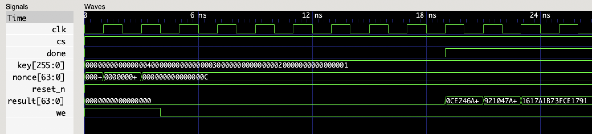

# Pipelined 64-bit SipHash2-4 in Verilog

This is a proof-of-concept implementation of [SipHash2-4](https://en.wikipedia.org/wiki/SipHash) with 64-bit wide internal state registers.

## Simulate with Verilator

1. Install [Verilator](https://www.veripool.org/projects/verilator/wiki/Installing)

	```bash
	brew cask install verilator
	```

2. Build and run testbench

	```bash
	cd bench
	make
	./siphash/Vsiphash_top
	```	

3. Observe results in STDOUT and use `gtkwave` to open `siphash/Vsiphash_top.vcd`

## Use in your verilog design

SipHasher module instance example:

```verilog
	siphash hasher(
		.clk(clk),				// Clock signal
		.reset_n(reset_n),		// Reset signal

		.we(hasher_we),			// Write-enable signal to allow writing values of key and nonce
		.cs(hasher_cs),			// Chip-select signal to allow to perform hash computation

		.key(hasher_key),		// A 256-bit register for four 64-bit SipHash keys: k0, k1, k2, k3 starting from LSB
		.nonce(hasher_nonce), 	// A 64-bit input to the SipHash function

		.done(hasher_done),		// A valid hash value sign, allows to read hash value on/after a positive edge of this signal

		.result(hasher_result), // A 64-bit SipHash result value, should be read only when `done` signal is HIGH
	);
```

Since this SipHash module is pipelined, it able to continiously calculate hashes and provide consequent hash results
on each clock cycle after initial pipeline delay in 10 clock cycles.

To optimally utilize the pipeline, user should feed input values (nonces) on each clock cycle after
module reset.

## Timing diagram example with three hash values



# License

MIT. 

See [LICENSE.md](LICENSE.md)
